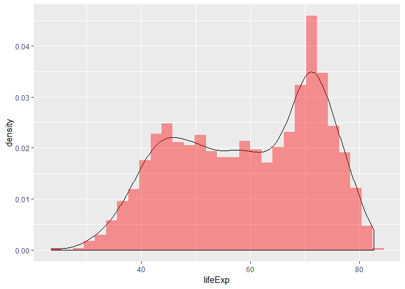
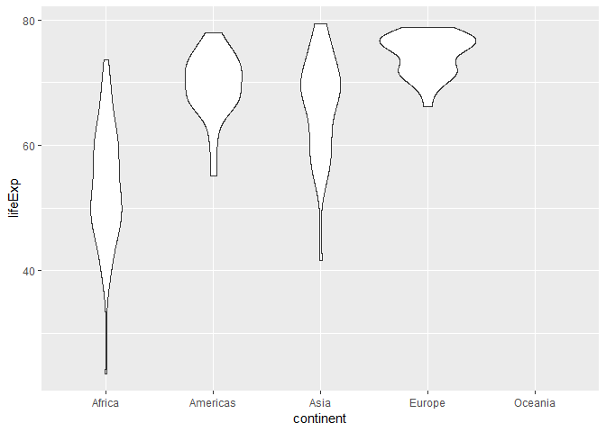

Homework 2
================

Aidan Hughes

Student \# 18045138

Tuesday, September 25, 2018

Exploring the Gapminder Object
------------------------------

Let's look at a bunch of stats about the full Gapminder dataframe.

``` r
library("gapminder")
library("tidyverse")
```

    ## -- Attaching packages --------------------------------------------------------------------------------------------- tidyverse 1.2.1 --

    ## v ggplot2 3.0.0     v purrr   0.2.5
    ## v tibble  1.4.2     v dplyr   0.7.6
    ## v tidyr   0.8.1     v stringr 1.3.1
    ## v readr   1.1.1     v forcats 0.3.0

    ## -- Conflicts ------------------------------------------------------------------------------------------------ tidyverse_conflicts() --
    ## x dplyr::filter() masks stats::filter()
    ## x dplyr::lag()    masks stats::lag()

``` r
# Type/ class of the object
typeof(gapminder)
```

    ## [1] "list"

``` r
class(gapminder)
```

    ## [1] "tbl_df"     "tbl"        "data.frame"

``` r
# Size of the object
nrow(gapminder)
```

    ## [1] 1704

``` r
ncol(gapminder)
```

    ## [1] 6

``` r
# or
length(gapminder)
```

    ## [1] 6

``` r
# Data type of each variable
str(gapminder)
```

    ## Classes 'tbl_df', 'tbl' and 'data.frame':    1704 obs. of  6 variables:
    ##  $ country  : Factor w/ 142 levels "Afghanistan",..: 1 1 1 1 1 1 1 1 1 1 ...
    ##  $ continent: Factor w/ 5 levels "Africa","Americas",..: 3 3 3 3 3 3 3 3 3 3 ...
    ##  $ year     : int  1952 1957 1962 1967 1972 1977 1982 1987 1992 1997 ...
    ##  $ lifeExp  : num  28.8 30.3 32 34 36.1 ...
    ##  $ pop      : int  8425333 9240934 10267083 11537966 13079460 14880372 12881816 13867957 16317921 22227415 ...
    ##  $ gdpPercap: num  779 821 853 836 740 ...

Exploring some Variables
------------------------

Here we explore the Gapminder dataframe a bit and then look at the years data was taken, and the contries, individually.

``` r
# Start of with summary of the full data frame
summary(gapminder)
```

    ##         country        continent        year         lifeExp     
    ##  Afghanistan:  12   Africa  :624   Min.   :1952   Min.   :23.60  
    ##  Albania    :  12   Americas:300   1st Qu.:1966   1st Qu.:48.20  
    ##  Algeria    :  12   Asia    :396   Median :1980   Median :60.71  
    ##  Angola     :  12   Europe  :360   Mean   :1980   Mean   :59.47  
    ##  Argentina  :  12   Oceania : 24   3rd Qu.:1993   3rd Qu.:70.85  
    ##  Australia  :  12                  Max.   :2007   Max.   :82.60  
    ##  (Other)    :1632                                                
    ##       pop              gdpPercap       
    ##  Min.   :6.001e+04   Min.   :   241.2  
    ##  1st Qu.:2.794e+06   1st Qu.:  1202.1  
    ##  Median :7.024e+06   Median :  3531.8  
    ##  Mean   :2.960e+07   Mean   :  7215.3  
    ##  3rd Qu.:1.959e+07   3rd Qu.:  9325.5  
    ##  Max.   :1.319e+09   Max.   :113523.1  
    ## 

``` r
# See how many unique years of data and the range of years
select(gapminder, year) %>%
  distinct() -> years
years
```

    ## # A tibble: 12 x 1
    ##     year
    ##    <int>
    ##  1  1952
    ##  2  1957
    ##  3  1962
    ##  4  1967
    ##  5  1972
    ##  6  1977
    ##  7  1982
    ##  8  1987
    ##  9  1992
    ## 10  1997
    ## 11  2002
    ## 12  2007

``` r
# See how many unique years there are and the range
years %>%
  { c(nrow(.), range(.)) } -> yearstats
yearstats
```

    ## [1]   12 1952 2007

``` r
# Try the same for "country"
select(gapminder, country) %>%
  distinct() -> countries

countries
```

    ## # A tibble: 142 x 1
    ##    country    
    ##    <fct>      
    ##  1 Afghanistan
    ##  2 Albania    
    ##  3 Algeria    
    ##  4 Angola     
    ##  5 Argentina  
    ##  6 Australia  
    ##  7 Austria    
    ##  8 Bahrain    
    ##  9 Bangladesh 
    ## 10 Belgium    
    ## # ... with 132 more rows

``` r
nrow(countries)
```

    ## [1] 142

Data Plotting
-------------

Next, we plot a distribution and violin plot, similar to what was done in class. We can also use the `filter` function to plot a smaller set of data.

``` r
# As done in class, view the probability distribution for a variable
ggplot(gapminder, aes(lifeExp)) +
  geom_density() +
  geom_histogram(aes(y=..density..),fill='red', alpha=0.4)
```

    ## `stat_bin()` using `bins = 30`. Pick better value with `binwidth`.



Let's try a violin plot of a given year's life expectancy for each continent.

``` r
filter(gapminder, year==1992) %>%
  ggplot(aes(continent, lifeExp)) +
  geom_violin()
```



**Where did Oceania go?** Looking at the data for 1992, the reason is that it is only a small data set.

``` r
filter(gapminder, continent=="Oceania", year==1992)
```

    ## # A tibble: 2 x 6
    ##   country     continent  year lifeExp      pop gdpPercap
    ##   <fct>       <fct>     <int>   <dbl>    <int>     <dbl>
    ## 1 Australia   Oceania    1992    77.6 17481977    23425.
    ## 2 New Zealand Oceania    1992    76.3  3437674    18363.
